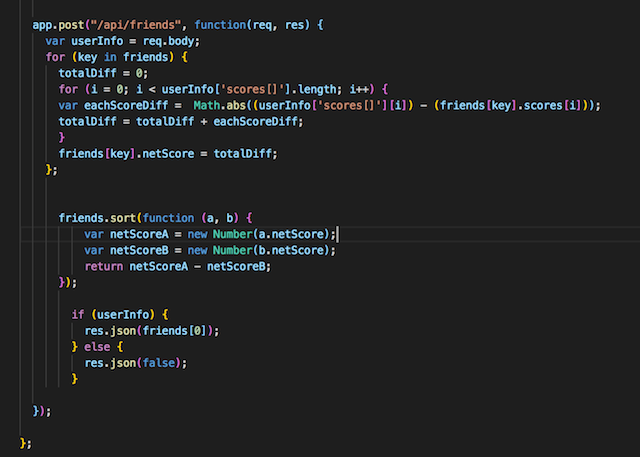

# GolfBuddy
Title: GolfBuddy
Author: Susan Lippa <slippa91@gmail.com>
Dates:  Jan 17-23, 2018 (week6)
For:  Northwestern Coding Bootcamp
Published: GitHub <https://slippa91.github.io/FriendFinder/>
Built with: HTML5, CSS3, Boostrap3, Chosen library, Javascript, jQuery & Node.js (with Express.js). 

The App: 

The user is asked for a response to 10 (somewhat silly) golf related survey questions. The answers are compared to the answers of the 5 hand-picked professional golfers. Using a net-differential to compare scores, the pros are sorted to find the ideal one to be your next GolfBuddy!

Purpose of the App:

Practice, practice, practice. The focus of this project was the use of Node.js, Express.js and the creation of the relevant html & API routes.

The Engine:

What makes this program work is the following function. I welcome comments on how to improve the code. 

Select Box Styling:

After researching, I used used 'Chosen' to style my select boxes.  

The link for the CDN: <https://cdnjs.com/libraries/chosen> \
The link to the Chosen website: <https://harvesthq.github.io/chosen/> 